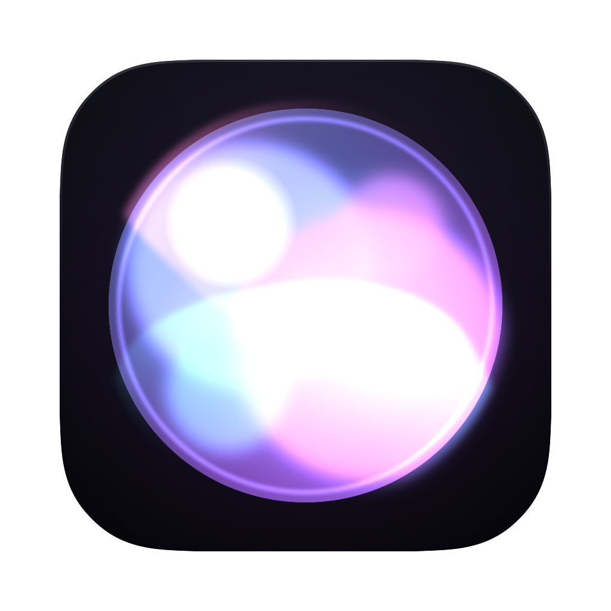
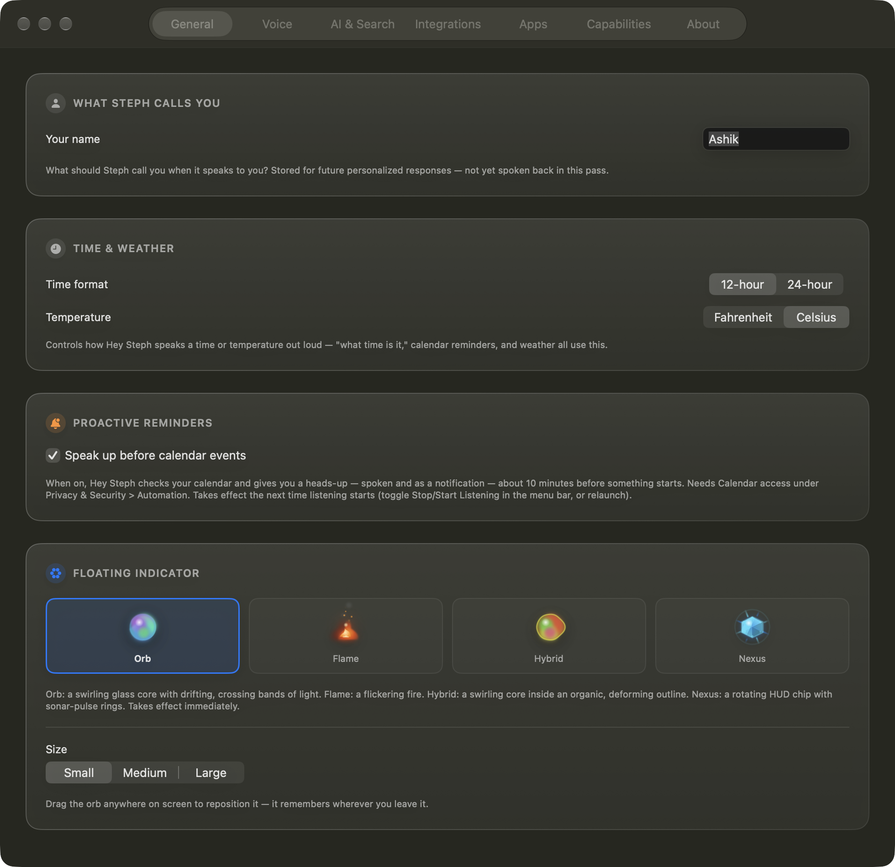
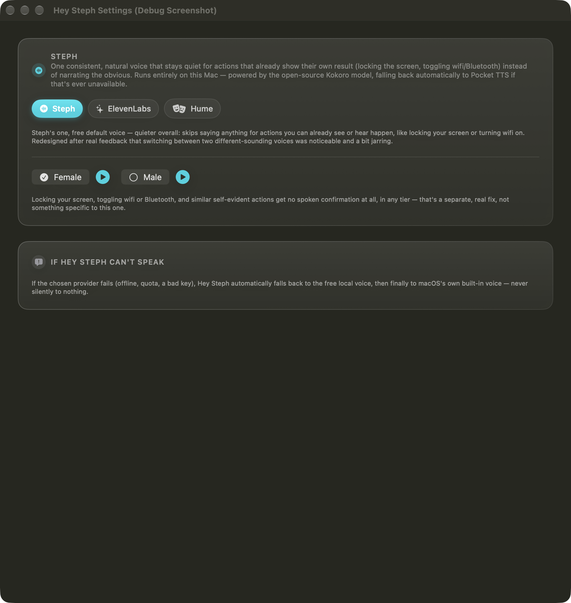
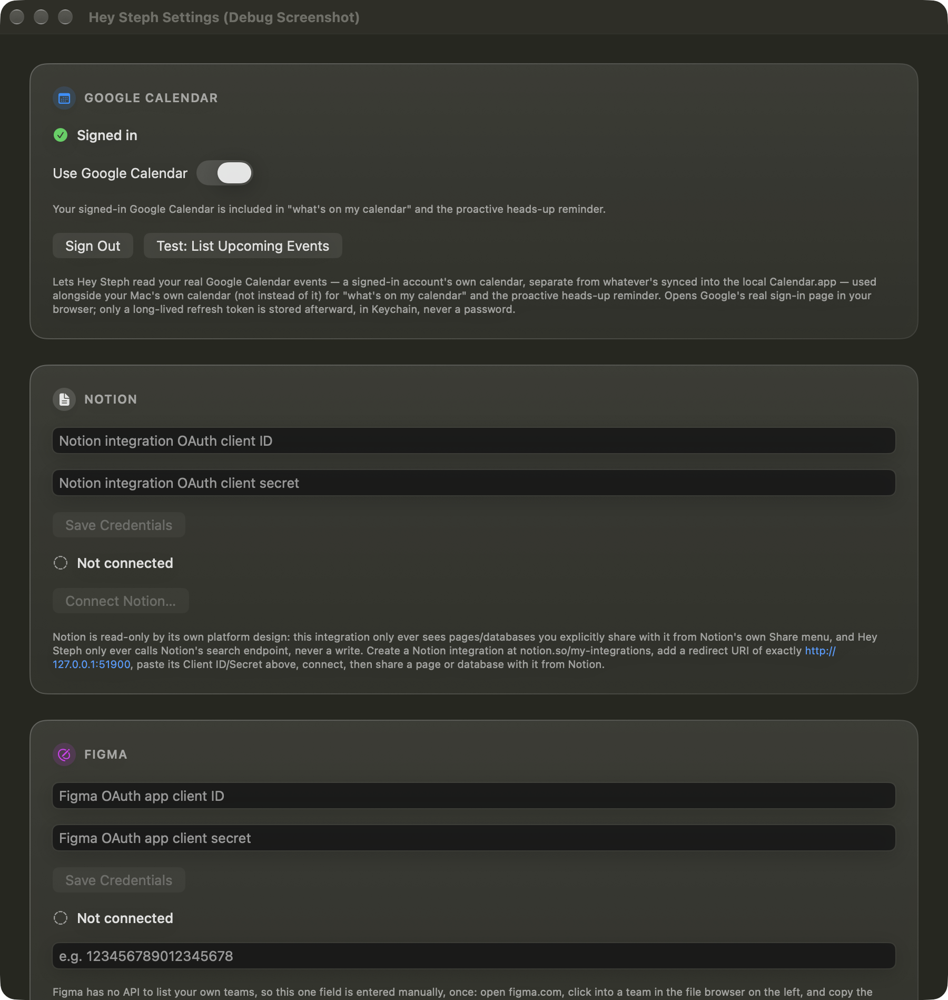
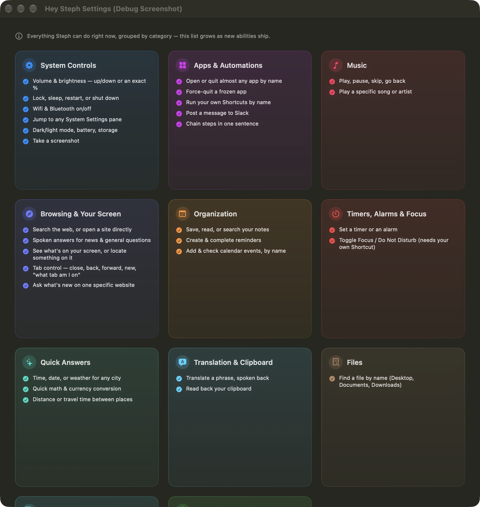

  

<h1 align="center">Hey Steph</h1>

  <strong>Voice-controls your daily work stack — reliably, not everything.</strong>

  A native macOS menu-bar voice assistant. Wake-word activated, no clicking required.

---

## What it is

Voice control on Mac today is either too shallow (Siri: single-shot commands, no
chaining) or too broad and brittle (general GUI-automation agents that break
constantly whenever an app changes its UI).

Hey Steph doesn't try to control *every* app. It controls a small, deliberate set
of things — your Mac's system controls plus a handful of real app integrations —
through native APIs instead of screen-scraping. That's a narrower promise than
"do anything," but it's one that's actually kept.

It lives quietly in your menu bar, listens for a wake word, and talks back.

## How it's built

This is a solo-developer project, built by Ashik working directly with Claude —
real, hands-on engineering sessions, not a generated demo. A few honest
highlights, because the process is part of what makes this different from a
typical "voice assistant" side project:

- **The free tier is genuinely engineered, not a downgrade.** The on-device
  routing model was fine-tuned (a real teacher/student distillation pass) to
  imitate a much larger model's judgment — held-out accuracy went from 91% to
  96% on one real test set and 93% to 94% on another, with **zero regressions**,
  verified before it ever shipped. The paid cloud options are a genuine upgrade
  for people who want them, never a requirement to get a good experience.
- **Real bugs get root-caused, not patched over.** Example: a live crash
  traced to a Swift concurrency race — two parts of the app could resolve the
  same async operation at once — fixed by finding the actual data race, not by
  adding a delay and hoping. Another: the voice engine was found to leak GPU
  memory unboundedly during long sessions (14GB+ after extended use); root-caused
  to a missing cache limit in the underlying ML framework and fixed with real
  before/after measurements (a ~90% reduction, no speed cost).
- **A real security review happened before anything shipped publicly.** Every
  OAuth-based integration was checked for a real vulnerability class (a
  malicious local process intercepting a sign-in) and fixed across the board —
  not left as a theoretical risk.
- **Everything is tested against reality, not assumptions.** Free web search
  options were live-tested one by one (several turned out to be dead or
  blocked in 2026) before landing on what actually works. A "smart end-of-turn"
  detection feature was verified with real timing numbers (a real command now
  finishes in under 300ms instead of over 700ms) rather than shipped on vibes.

The point isn't that mistakes don't happen — plenty did, and they're logged
honestly rather than hidden. The point is that everything here is backed by
real evidence, not just claimed.

  

## Screenshots

Real captures of the actual app, running on Apple Silicon.

| General | Voice |
|---|---|
|  |  |

| Integrations | Capabilities |
|---|---|
|  |  |

## What it can actually do

Every item below is real and already shipped — this is a straight pull from the
app's own in-Settings capability reference, not aspirational copy.

**System controls**
Volume & brightness (up/down or an exact %) · lock, sleep, restart, shut down ·
Wi-Fi & Bluetooth on/off · jump to any System Settings pane · dark/light mode,
battery, storage · take a screenshot

**Apps & automations**
Open or quit almost any app by name · force-quit a frozen app · run your own
Shortcuts by name · post a message to Slack · chain multiple steps in one
sentence ("turn up the volume and open Safari" really does both)

**Music**
Play, pause, skip, go back · play a specific song or artist (Apple Music)

**Browsing & your screen**
Search the web, or open a site directly · spoken answers for news and general
questions · see what's on your screen, or locate something on it · tab control
(close, back, forward, new, "what tab am I on") · ask what's new on a specific
website

**Organization**
Save, read, or search your notes · create & complete reminders · add & check
calendar events by name · a spoken daily briefing across Calendar, Reminders,
and Notes

**Timers, alarms & focus**
Set a timer or an alarm · toggle Focus / Do Not Disturb

**Quick answers**
Time, date, or weather for any city · quick math & currency conversion ·
distance or travel time between places

**Translation & clipboard**
Translate a phrase, spoken back · read back your clipboard

**Files**
Find a file by name across Desktop, Documents, Downloads

**Conversation & dictation**
Chat naturally, no fixed command phrasing needed · dictate into any focused
text field

**Remembering things**
Ask it to remember a fact about you for later · "forget everything," any time

### Integrations (bring your own account)

All read access, connected via OAuth, credentials never leaving your Mac:

| Service | What it's used for |
|---|---|
| Google Calendar | "What's on my calendar," proactive heads-up before events |
| Notion | "What's pending in Notion" — pages/databases you explicitly share |
| Figma | New comments across your team's files |
| ClickUp | Tasks due or overdue, assigned to you |
| GitHub | Recent commit/repository activity |
| Linear | Issues assigned to you |
| Slack | Read channels the bot's been invited to; post a message on request |

Optional premium upgrades (bring your own API key) are also supported for
higher-quality conversation and voice: Anthropic (Claude), Google (Gemini),
ElevenLabs, and Hume. None of these are required — the app is fully usable
with zero cloud accounts connected.

## Requirements & status

Read this before you get excited — it's an early, honest build, not a
polished 1.0.

- **Apple Silicon Macs only** (M1 or later). There is no Intel build.
- **Local-first by design.** Core features — wake word, speech-to-text,
  command understanding, and voice replies — run entirely on-device via
  local models (MLX). No account, no Hey Steph server, no required API key.
- **Cloud integrations are all opt-in.** Calendar/Notion/Figma/ClickUp/
  GitHub/Linear/Slack and the premium AI providers listed above only ever
  activate if you connect them yourself, with your own credentials.
- **This is an early, single-developer build, not a finished product.**
  It works well on the developer's own machine today. Getting it to work
  the same way on an arbitrary stranger's Mac — packaging, code signing,
  and making the local "understanding" model runnable outside one specific
  dev environment — is real, ongoing work that isn't finished yet. That's
  being tracked and worked through deliberately rather than papered over.

## Download

**[Download the latest release](../../releases/latest)** — an early alpha
build, real and installable today, with the honest caveats spelled out
above (see **Requirements & status**) and repeated on the release page
itself.

It's not signed with an Apple Developer ID yet, so macOS will warn that
it's from an unidentified developer the first time you open it — right-click
the app and choose **Open** (or allow it under System Settings → Privacy &
Security) to get past that. A properly signed, notarized release with
real auto-updates is in progress but not ready yet.

This repository is a public-facing overview, not the source tree — the app
is still closed-source while it's under active, early development.

## Privacy

The short version, pulled from the app's real privacy policy:

- **Everything runs on your own Mac by default.** There's no Hey Steph
  account, no Hey Steph server, and nothing about your voice, files,
  calendar, or messages is ever sent to the developer.
- **Credentials live only in your Mac's own Keychain** — OAuth tokens and
  any API keys you add, stored the same way Safari or Mail store your
  saved passwords. Nothing is written to a plain-text file or a log.
- **No analytics, telemetry, or crash-reporting SDK of any kind.**
- **Optional cloud features talk directly to that provider**, device-to-
  provider, using only credentials you hold — never routed through any
  server belonging to Hey Steph or its developer.

## Feedback & issues

This is a solo-developer project in active, early development. If you run
into something or have a question, please open a GitHub issue on this
repository.

## License

No license has been chosen for this project yet — all rights reserved by
default until that decision is made.
